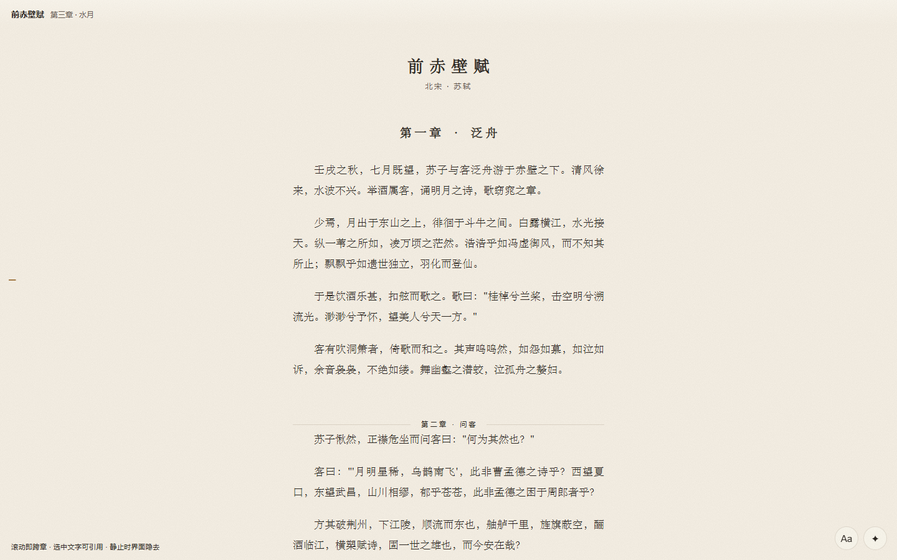

# 书友 BookMate · AI 陪伴阅读

> 让 AI 成为一起读书的伙伴。一个运行在 [Hana](https://github.com/liliMozi/openhanako) 里的 EPUB 沉浸阅读应用：你读，它陪；你问，它答；你们聊过的每一句，它都记得。

**English**: BookMate is an immersive EPUB reader built as a Hana App. It pairs you with an AI reading companion ("书友") who has read the book alongside you — answering questions, discussing ideas, and remembering your conversations across chapters. All data stays local; the companion uses whatever model you have configured in Hana. MIT licensed.

## 它是什么

BookMate 不是"带 AI 问答的阅读器"，它是一种阅读关系：

- **文字是主角，界面退后**。无边框阅读页、自动隐现的控件、宋体排版、纸纹与双主题（可跟随宿主深浅色）
- **对话是尺牍，不是聊天**。书友的话是带落款的信笺，你的话是右对齐的短签，引用是页边的批注细线
- **每本书一段连续对话**。不按章切分聊天记录；发送时书友拿到的上下文永远是你当下读到的位置
- **全书骨架（Skeleton）**。每章读完可沉淀一页结构化笔记，累积成骨架；对话时骨架注入，书友因此能跨章节关联，而不必每次重读原文

## 特性

**阅读**

- EPUB 本地解析导入（Python 辅助解析，不经过任何远端服务）
- 窗口化无限滚动：整本书一条流，章节分隔线内联于正文
- 排版面板：字体 / 字号 / 行距 / 页宽（含满宽）/ 主题（跟随宿主、暖纸、墨夜）/ 纸纹 / 首行缩进
- 章节导轨：左缘一列刻度，悬停成金字塔形缩放，浮出章节预览，点击跳转
- 选中句子即可划线或引用，划线按（章节·段落·起止）三元组锚定，重排不丢

**书友**

- 首次使用自动从内置角色包创建专用「书友」Agent（人格随应用分发，宿主托管，可复用、可删除）
- 划线即引：选句 → 引用 → 提问，引用自动随行
- 沉淀本章：生成结构化章节笔记进入全书骨架
- 新对话 / 历史对话（只读回看）/ 清除对话，对话操作收进一枚 ⋯ 菜单
- 可切换使用你自己花名册里的任何 Agent 作为伴读
- 导出本书为 Markdown：章节骨架 / 立场演变 / 划线

**隐私**

- 全部数据保存在本地 `~/.hanako/app-data/bookmate/`，无遥测、无分析、无官方后端
- 对话使用你在 Hana 中配置的默认模型，消耗你自己的模型额度；也可以为书友单独指定模型
- 书友的聪明程度取决于你的默认模型——建议配置足够强的模型以获得好的伴读体验

## 安装

**从 Release 安装（推荐）**

1. 下载最新 Release 的 `bookmate-<version>.zip`
2. 在 Hana 的「市场 → 已安装」页选择从 ZIP 安装，确认权限审查卡
3. 打开「书友」卡片，导入一本 EPUB，开始读

**从源码安装**

把本仓库目录整个放入 `<HANA_HOME>/apps/bookmate/`（目录名必须是 `bookmate`），在「市场 → 已安装 → 待批准」中批准。

## 使用闭环

导入 EPUB → 阅读（划线/引用）→ 与书友对话 → 沉淀本章进骨架 → 导出 Markdown 到你的知识库

## 设置项

| 设置 | 说明 |
| --- | --- |
| Python command | EPUB 解析用的 Python 可执行命令，默认 `python` |
| 导出目录 | Markdown 导出目录，建议指向你的知识库（如生活外脑 raw/阅读） |
| 书友人格 Agent | 书友对话使用的专用助手 id。留空则首次使用自动创建并填入；也可手填你自己 Agent 的 id |

## 权限说明

安装时应用会请求这些能力，每一项的用途：

- `process.spawn`：调用本机 Python 解析 EPUB
- `resources.read/write`：读取导入的 EPUB 文件、写出导出的 Markdown
- `session.start-turn` / `models.infer`：书友对话与骨架生成的模型调用（走你自己的模型配置）
- `agents.read`：列出你的 Agent 花名册供切换伴读
- `tools.expose-to-model`（默认关闭）：允许模型自主调用导入/导出工具

## 架构

见 [ARCHITECTURE.md](ARCHITECTURE.md)。一句话：Hono 后端路由 + 本地 JSON 存储 + 静态 UI（无构建步骤），书友人格走 Hana v2 内嵌角色包。

## License

[MIT](LICENSE) © XuJC
